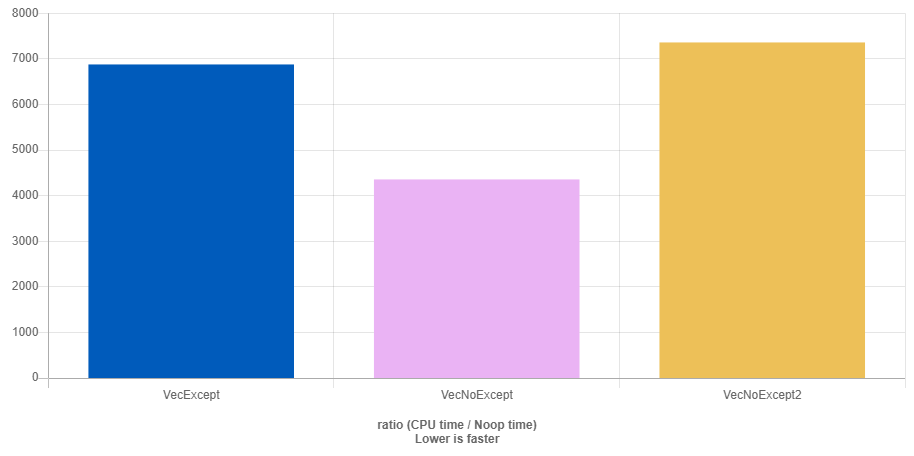

0. **Exceptions**
    - Что такое? Ключевые слова
    - Не любая ошибка == исключение!
    - Копирования?
    - Unwinding stack
    - Правило ловли в catch
1. **Исключения в конструкторах и деструкторах**
    - Проблема частно в утечке памяти! (RAII)
    - function try block
    - деструкторы ? 
2. **Guarantees**
    - Смотрим код из [файлика](safety_lecture_Bulat_Ibragimov.cpp) (он с [лекции](https://disk.yandex.ru/d/8WEwY2fFdzje5g/C%2B%2B/%D0%9B%D0%B5%D0%BA%D1%86%D0%B8%D1%8F11-1.%20%D0%98%D1%81%D0%BA%D0%BB%D1%8E%D1%87%D0%B5%D0%BD%D0%B8%D1%8F%20II/Lecture11-1.ExceptionsII.mp4?w=1) 21 года)
    - Nothrow guarantees == _Функция удовлетворяет гарантии отсутствия исключений, если она **никогда** не бросает исключений._
    - Базовая == _Функция удовлетворяет базовой гарантии безопасности, если после возникновения исключения все компоненты программы находятся в **согласованном** (валидном состоянии), утечки ресурсов не произошло._
    -  Ресурсы не утекут, но состояние объекта может измениться.
    - Строгая == _Функция удовлетворяет строгой гарантии безопасности, если после возникновения исключения все компоненты программы находятся **в том же** состоянии, что и до вызова, утечки ресурсов не произошло._
    - Это похоже на транзакцию: либо все проходит, либо ничего не изменяется
3. **Эффективность != Безопасность**
    - Смотрим код из [файлика](noexcept_lecture_Bulat_Ibragimov.cpp) (он с [лекции](https://disk.yandex.ru/d/8WEwY2fFdzje5g/C%2B%2B/%D0%9B%D0%B5%D0%BA%D1%86%D0%B8%D1%8F11-1.%20%D0%98%D1%81%D0%BA%D0%BB%D1%8E%D1%87%D0%B5%D0%BD%D0%B8%D1%8F%20II/Lecture11-1.ExceptionsII.mp4?w=1) 21 года)
    - noexcept не просто так существует!
4. **Vector**
    - Мы многое уже обсуждали...
    - [крутая статья, там есть про вектор](https://tproger.ru/articles/isklyucheniya-v-c-garantii-bezopasnosti-i-specifikacii)
5. **Производительность в векторе**
    - F_except, у которого есть обычный конструктор перемещения;
    - F_noexcept, у которого конструктор перемещения помечен как noexcept;
    - F_noexcept2 — как F_noexcept, но с деструктором, помеченным как noexcept(false). Деструктор нужно явно помечать как noexcept(false), иначе он считается невыбрасывающим.
      
    - [Файлик](main.cpp)
6. **std::uninitialized_**
    - Рассмотрим написание аналогов алгоритмов std::uninitialized_copy и std::uninitialized_fill, которые управляют временем жизни объектов и предоставляют строгую гарантию безопасности.
```cpp
#include <memory>
#include <iterator>
#include <algorithm>

template<typename InputIt, typename ForwardIt>
ForwardIt safe_uninitialized_copy(InputIt first, InputIt last, ForwardIt d_first) {
    ForwardIt current = d_first;
    try {
        for (; first != last; ++first, (void) ++current) {
            ::new (static_cast<void*>(std::addressof(*current))) typename std::iterator_traits<ForwardIt>::value_type(*first);
        }
    } catch (...) {
        for (; d_first != current; ++d_first) {
            d_first->~value_type();
        }
        throw;
    }
    return current;
}

template<typename ForwardIt, typename T>
void safe_uninitialized_fill(ForwardIt first, ForwardIt last, const T& value) {
    ForwardIt current = first;
    try {
        for (; current != last; ++current) {
            ::new (static_cast<void*>(std::addressof(*current))) typename std::iterator_traits<ForwardIt>::value_type(value);
        }
    } catch (...) {
        for (; first != current; ++first) {
            first->~value_type();
        }
        throw;
    }
}

```
7. **Бонусы**
    - [Релизация](https://www.youtube.com/watch?v=_wE7JYfcKN0) std::vector от Мещерина
    - [Статья](https://habr.com/ru/articles/126374/) на хабре про гарантии безопасности
    - [Хабр:](https://habr.com/p/806239/) Разработчик взломал компилятор C++ 28-летней давности, чтобы проект поддерживал исключения 
