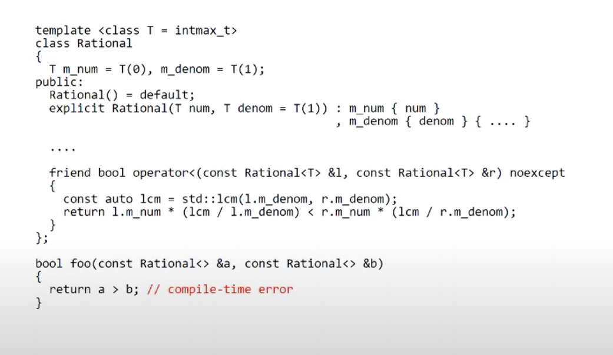
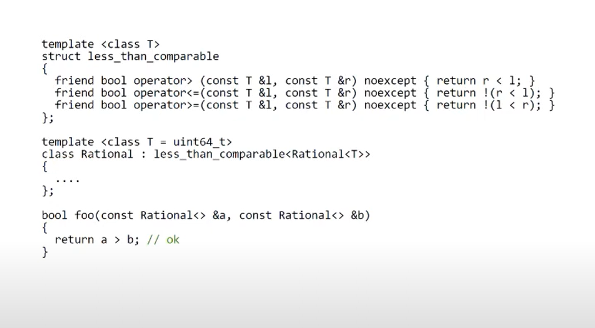

0. **array_traits**
    - Unary type traits
    - Type relationships
    - Type transformations
    - Logical operations
2. **lecture**
    - Что вы помните ?
    - Определители типов ? Преобразования типов ?
    - SFINAE ? 
4. **decltype + declval**
    - decltype - позволяет узнать тип и категорию значения, declval - "мнимо" создаёт объект/вычисляет выражение/обращается к объекту 
    - ```cpp
      template<typename T>  auto has_begin_end(T&& t) -> decltype(t.begin(), t.end(), std::true_type{});
      ```
    - ```cpp
      template<typename T, typename U> auto add_result_type() -> decltype(std::declval<T>() + std::declval<U>());
      ```
```cpp
#include <iostream>
#include <typeinfo>

int main() {
    int x = 0;
    double y = 0.0;

    decltype(x) a = 2;
    std::cout << "decltype(x) a -> " << typeid(a).name() << std::endl;

    decltype(x)& b = a;
    std::cout << "decltype(x)& b -> " << typeid(b).name() << std::endl;

    decltype(throw 1)* p = nullptr;
    std::cout << "decltype(throw 1)* p -> " << typeid(p).name() << std::endl;

    decltype(x ? y : y) c = y;
    std::cout << "decltype(x ? y : y) c -> " << typeid(c).name() << std::endl;

    decltype((x)) d = x;
    std::cout << "decltype((x)) d -> " << typeid(d).name() << std::endl;

    decltype(x++) e = x;
    std::cout << "decltype(x++) e -> " << typeid(e).name() << std::endl;

    decltype(x + y) f = x + y;
    std::cout << "decltype(x + y) f -> " << typeid(f).name() << std::endl;

    decltype(&x) g = &x;
    std::cout << "decltype(&x) g -> " << typeid(g).name() << std::endl;

    decltype(*g) h = x;
    std::cout << "decltype(*g) h -> " << typeid(h).name() << std::endl;

    decltype(std::cin.get()) i = 'a';
    std::cout << "decltype(std::cin.get()) i -> " << typeid(i).name() << std::endl;

    int arr[5] = {0};
    decltype((arr)) k = arr;
    std::cout << "decltype((arr)) k -> " << typeid(k).name() << std::endl;

    decltype(arr[0]) l = x;
    std::cout << "decltype(arr[0]) l -> " << typeid(l).name() << std::endl;

    auto m = x;
    decltype(m) n = x;
    std::cout << "decltype(m) n -> " << typeid(n).name() << std::endl;

    return 0;
}

```      
5. **SFINAE**  == substitution failure is not an error, «неудавшаяся подстановка — не ошибка»
    - std::enable_if
    - [is_class](https://en.cppreference.com/w/cpp/types/is_class)
    - [is_polymorphic](https://en.cppreference.com/w/cpp/types/is_polymorphic)
    - Детекторы
      - Можно ли присвоить элемент?
      - Существует ли небросающий конструктор?
      - Полиморфность класса? 
6. **SRTP** == curiously recurring template pattern
    - Rational ><==! ?
    - Mixin == Подмешивание
    - [Хабр](https://habr.com/ru/articles/210894/), [статья](https://nuancesprog.ru/p/15557/).  


7. Bonus
    - Простая и понятная [лекция](https://www.youtube.com/watch?v=-PKyagrtIfs&ab_channel=PVS-StudioRu) про метапрограммирование от PVS-Studio. Куча примеров и про всё по чуть-чуть.
    - [cppreference](https://en.cppreference.com/w/cpp/meta)
    - [if_constexpr](https://habr.com/ru/articles/351970/) статья на Хабре
