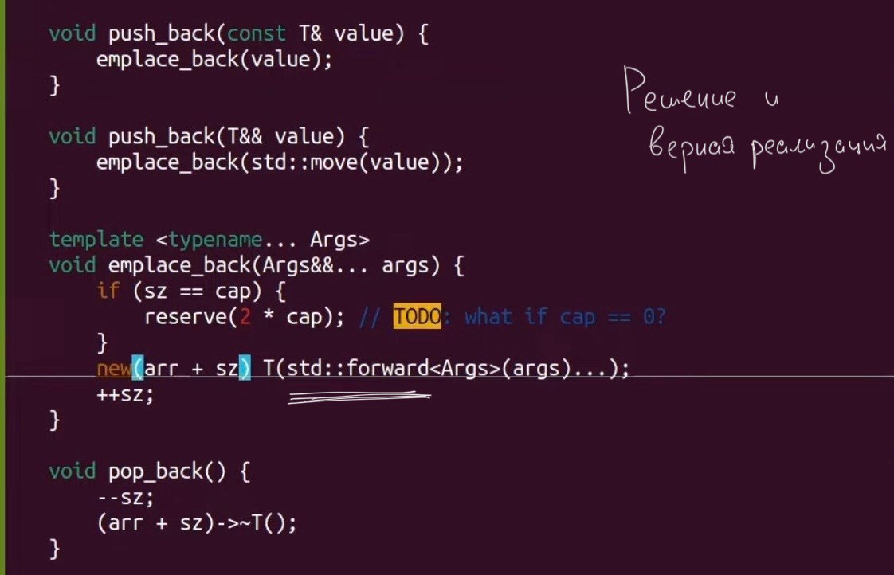

0. Зачем?
  - Принимать/передавать rvalue lvalue вместе?
  - Дублирование кода при перегрузке функций
  - НЕОБХОДИМО при передаче переменного числа аргументов
1. Universal referenses
[C++ 6. Rvalue references. Universal references (Мещерин)](https://www.youtube.com/watch?v=wu66JJ8ATbg&list=PL4_hYwCyhAvaWsj3-0gLH_yEZfKdTife0&index=7)
```c++
// Universal references
void f(int& x); // only lvalue
void f(int&& x); // only rvalue

template <typename T>
void g(T&& x);  // universal == both lvalue+rvalue

//auto && x = pass ;
// Важно, константность, метод шаблонного класса, всё это нарушает 'универсальность'

```
2. Сворачивание ссылок  
 **& + & == &  
 & + && == &  
 && + & == &  
 && + && == &&**
3. Perfect forwarding
```c++
template <typename T>
void g(T&& x);  // universal == both lvalue+rvalue

g(expr); вызываем g 
1.
// type(expr) == int &&
// expr == rvalue
// T = int
// type(x) == int &&
2.
// type(expr) == int &
// expr == lvalue
// T = int &
// type(x) == int & && == int &
3.
// type(expr) == int
// expr == lvalue
// T = int &
// type(x) == int &

```
4. std::forward  
  - Что делает?
  - Всё что было передано как lvalue - отдаёт дальше как lvalue и аналогично с rvalue
  - _Важно понимать, что ‘std::forward’ сам по себе не делает аргумент ни lvalue, ни rvalue. Он просто возвращает аргумент в том же состоянии (lvalue или rvalue), в котором он был передан._
```c++
// Implementation std::forward
template <typename T>
T&& forward(std::remove_reference_t<T> & y) {
    return static_cast<T&&>(y);
}
template <typename T>
T&& forward(std::remove_reference_t<T> && y) {
    return static_cast<T&&>(y);
}

// Implementation std::move
template <typename T>
std::remove_reference_t<T> && move(T&& value) noexcept{
    return static_cast<std::remove_reference_t<T> &&> (value);
}
```
5. Проблемы в векторе:


6. Copy elision
  - lvalue и rvalue это не все категории значений...
```c++
// Copy elision
std::vector<int> f(){
    return std::vector<int> (10,1);
}
// (temporary materialization == материализация временного)
struct Mystruct {
    std::vector<int> h = std::vector<int> (10,1);
};
// RVO - слайд из лекции - когда возвращаем из функции то что в ней создали или просто rvalue - не будет лишнего копирования
```

7. Make.. (UniquePtr SharedPtr)
куча ссылок и информации в прошлом файле
```c++
template<typename T, typename... Args>
Unique_ptr<T> Make_unique(Args&&... args) {
    return UniquePtr<T>(new T(std::forward<Args>(args)...));
}
```
  - почему плохо?
  - как минимум из-за создания на массивы и из-за возможных исключений (могут быть из-за конструктора Т)


8. Декоратор Repeat(n, Func, Arg)
```c++

// Декоратор Repeat(n, Func, Arg)
template<typename Func, typename Arg>
void Repeat(int n, Func&& function, Arg&& arg) {
    for (int i = 0; i < n; ++i) {
        function(std::forward<Arg>(arg));
    }
}

void PrintMessage(const std::string& message) {
    std::cout << message << std::endl;
}
```
9. Шаблонный конструкторы
  - Часто случайно выигрывают перегрузку…
  - см последние слайды лекции

10. Задачки на переменное число аргументов
_На прошлом занятии не разобрали несколько примеров про переменное число аргументов. Вот “дз”, **необходимо** каждому решить **хотя бы одну** задачку. Примеры можно найти в презентации лектора, интернете итд.
Условия: функция принимает переменное число аргументов, реализуйте..._
1) Печать аргументов в обратном порядке (с помощью рекурсии)
2) AllOf, AnyOf, которые проверяют, все ли (хотя бы один из) аргументы интерпретируются как true (можно и с помощью рекурсии и с помощью fold expression)
3) Все ли аргументы равны 0 (с помощью рекурсии, с помощью fold expr, с помощью функции AllOf)
4) Все ли аргументы равны между собой (с помощью рекурсии, с помощью fold expr, с помощью функции AllOf)


_Пример решения первой задачки на переменное число аргументов_
```c++
template<typename T>  // Базовый случай, когда передан один аргумент
void print_reverse(const T& arg) {
    std::cout << arg << std::endl;
}

template<typename T, typename... Args>
void print_reverse(const T& first, const Args&... args) {
    print_reverse(args...); // Рекурсивный вызов с оставшимися аргументами
    std::cout << first << std::endl; // Печать текущего аргумента после рекурсивного вызова
}
```
